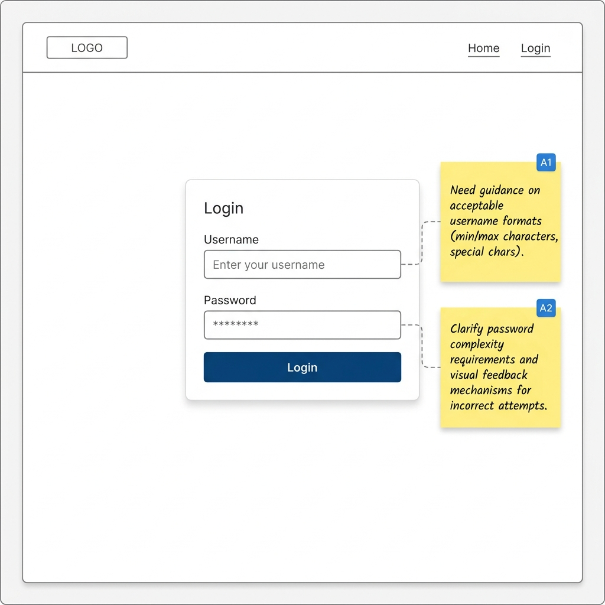

# AI Frontend Prototype Scaffold
> AI 原型前端快速脚手架 (axure_faster_skill)



这是一个专为 AI 编程助手（如 Claude Code、Gemini 等）量身定制的前端交互原型快速开发脚手架。它的目标是：**以极低的认知负载和零构建配置，帮助 AI 在几秒钟内将业务想法转化为可点击、带状态流转的高保真网页原型。**

## 为什么定义为 AI 原型脚手架？
- **零配置，即开即用**：没有 `package.json`，没有 Webpack/Vite 复杂的编译链。只有一个简单的 HTTP 服务即可运行，极大降低了 AI 配置环境的失败率。
- **声明式状态管理 (HTMX)**：AI 最擅长编写纯 HTML 和 CSS。通过引入 HTMX，AI 只需要在 HTML 标签中添加类似 `hx-get` 的属性，就能实现复杂的组件替换和无刷新交互（SPA体验），而无需手写晦涩的 JavaScript 状态逻辑。
- **内置原生设计系统 (Vanilla CSS)**：`index.html` 中预置了 `:root` 变量（设计令牌）和一套极其基础且美观的 CSS 样式库。AI 可以直接调用这些类名（如 `.card`, `.btn`, `.fade-in`）快速拼装界面，省去了配置 Tailwind 或 Bootstrap 的沟通成本。

## 目录结构
- `index.html`: 原型的骨架页面。内嵌了全局样式变量、HTMX CDN，并提供了一个基本的使用示例。
- `component.html`: 示例组件片段，用于展示 HTMX 如何异步拉取外部 HTML 进行局部替换。

## 快速启动
在当前目录下启动服务：
```bash
# 使用 npm 快速启动（默认端口 7788）
npm start

# 或手动使用 Python 环境
python3 -m http.server 7788

# 或使用 Node 环境
npx http-server -p 7788
```
然后在浏览器访问 `http://localhost:7788`。

## AI 使用指南 (给下一个 Agent 的提示)
当你被要求基于此脚手架设计原型时，请遵循以下原则：
1. **优先使用 HTMX**：通过创建多个 `.html` 片段（Fragments），并使用 `hx-get` 和 `hx-target` 串联起业务流。
2. **复用样式令牌**：使用 `index.html` 顶部定义的 `var(--primary-color)` 等变量来保持视觉统一。
3. **保持原子化**：不要将所有内容塞进一个文件。把不同的视图和状态切分为独立的 HTML 文件，这是 HTMX 发挥作用的最佳方式。
